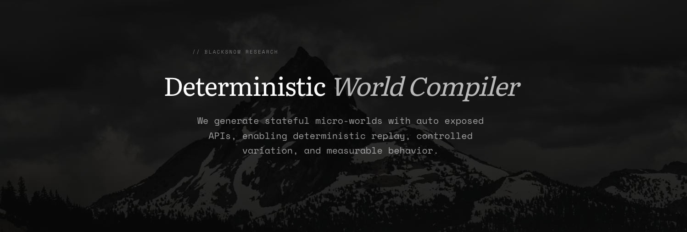
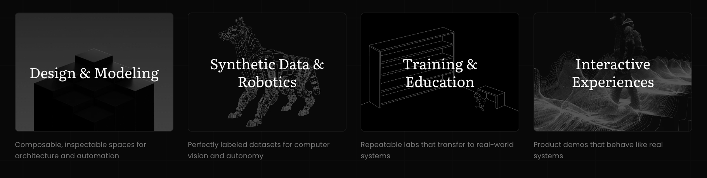

  <a href="https://blacksnow.cc">
    
     
    <b>BlackSnow</b>
  </a>

> [!NOTE]
> This is the public community repository for BlackSnow. The core engine is under active private development. This space exists for issues, feedback, and discussion.

---

**BlackSnow** is a generative engine for stateful, deterministic environments you can program against, replay and measure!

## The Problem

Today's generative AI produces impressive outputs — but outputs you can't control, rerun under identical conditions, or validate step by step. A generated image or scene is a static artifact. Change one thing and regenerate, and you get something different. There's no way to isolate variables, measure outcomes, or trust that the same input produces the same result.

This makes current generative tools unreliable for anything that requires repeatability: testing, training, simulation, validation.

## How BlackSnow Approaches It

Rather than treating generation as a rendering problem, BlackSnow treats it as a systems problem.

At a high level, the engine decomposes a request into smaller parts with defined constraints and interfaces, then compiles them into a stateful environment you can program against, rerun, and measure. A few concepts central to this approach:

- **Determinism** — given identical starting conditions, the system produces bit-perfect reproductions. Change one variable, rerun, observe the delta.
- **Procedural generation** — structural rules establish the ground-truth skeleton of a world: layout, relationships, constraints, entity counts.
- **Diffusion** — generative models are applied on top to add high-dimensional realism (textures, materials, variation) without breaking the underlying controllability.
- **Identity preservation** — objects, state, and interfaces stay consistent across time steps, preventing the identity drift common in unconstrained generation.

The result is environments that behave more like software than media — inspectable, testable, and replayable.

## Applications

The engine is applicable wherever reliable simulation matters:

- **Training & education** — repeatable lab environments that transfer to real-world systems
- **Synthetic data** — perfectly labeled datasets for computer vision and robotics
- **Design & modeling** — composable spaces for architecture and automation workflows
- **Interactive experiences** — product demos and simulations that behave like real systems

## This Repository

This is the public community repo for BlackSnow. The core engine is developed privately. This space is for:

- Bug reports and issue tracking
- Feature requests and feedback
- Public discussion

If you have a use case, question, or idea — open an issue.

## Contact

[hello@blacksnow.cc](mailto:hello@blacksnow.cc) · [blacksnow.cc](https://blacksnow.cc)
